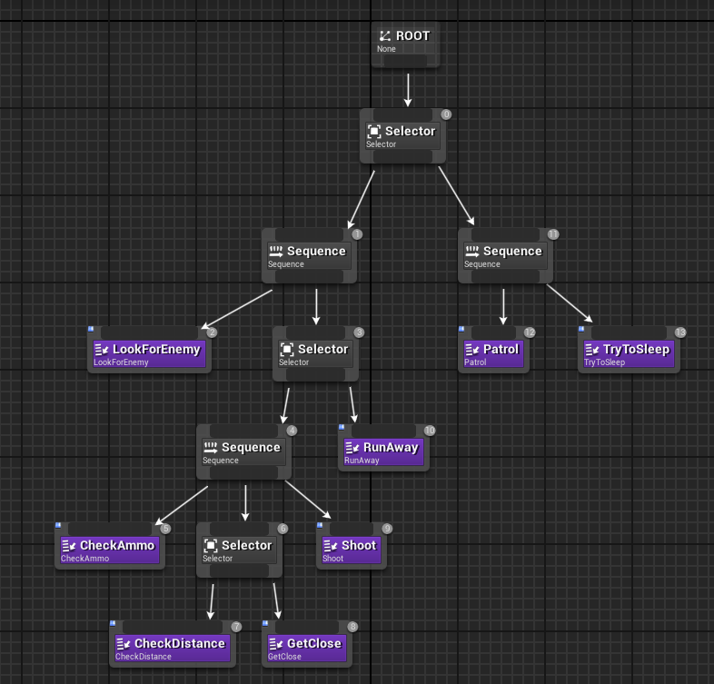

# Тестовое задание Saber Interactive на должность Gameplay Programmer 

## Задание 1

Реализуйте функции сериализации и десериализации двусвязного списка, заданного следующим образом:

    class ListNode
    {
        public ListNode Prev;
        public ListNode Next;
        public ListNode Rand; // произвольный элемент внутри списка
        public string Data;
    }

    class ListRand
    {
        public ListNode Head;
        public ListNode Tail;
        public int Count;

        public void Serialize(FileStream s)
        {
        }

        public void Deserialize(FileStream s)
        {
        }
    }

Примечание: сериализация подразумевает сохранение и восстановление полной структуры списка, включая взаимное соотношение его элементов между собой.  Формат сериализованного файла любой.
* Нельзя изменять исходную структуру классов ListNode, ListRand.
* **Алгоритмическая сложность решения должна быть меньше квадратичной.**
* Для выполнения задания можно использовать любой общеиспользуемый язык.
* Тест нужно выполнить без использования библиотек/стандартных средств сериализации.

## Задание 2

Составить BehaviourTree (в виде схемы) для NPC, который:
* в спокойном состоянии патрулирует территорию;
* по окончанию каждого патруля (окончанием считается возвращение в стартовую точку) NPC может или заснуть на 2 минуты или продолжить патруль;
* когда у NPC есть враг, он  атакует его, причем стрелять во врага может, только если у него есть патроны и враг на расстоянии меньше 30 метров;
* если патронов нет, то NPC убегает от врага.

### Узлы

#### LookForEnemy
Узел, в котором выполняется проверка на наличие врага в поле зрения.
* **success** - враг найден
* **failure** - враг не найден

#### Patrol
Узел, в котором выполняется движения персонажа по маршруту патрулирования.
* **running** - движение персонажа по маршруту
* **success** - патруль закончен

#### TryToSleep
Узел, в котором принимается решение и выполняется сон.
* **success** - персонаж засыпает
* **running** - персонаж спит 2 минуты
* **failure** - персонаж не засыпает

#### CheckAmmo
Узел, в котором происходит проверка наличия патронов.
* **success** - есть патроны
* **failure** - нет патронов

#### RunAway
Узел, в котором происходит движение персонажа в противоположную от противника сторону
* **running** - движение персонажа

#### CheckDistance
Узел, в котором происходит проверка дистанции до противника.
* **success** - дистанция меньше 30 метров
* **failure** - дистанция больше 30 метров

#### GetClose
Узел, в котором происходит сближение персонажа с противником.
* **running** - персонаж приближается в противнику

#### Shoot
Узел, в котором происходит стрельба по противнику.
* **running** - стрельба по противнику

### Порядок выполнения
1. Если **LookForEnemy** = **failure**, то **Patrol**. 
1.1 Когда **Patrol** = **success**, то **TryToSleep**. 
2. Если **LookForEnemy** = **success**, то **CheckAmmo** 
2.1 Если **CheckAmmo** = **failure**, то **RunAway**, пока **LookForEnemy** = **success** или **CheckAmmo** = **failure** 
3. Если **CheckAmmo** = **success**, то **CheckDistance** 
3.1 Если **CheckDistance** = **failure**, то **GetClose**, пока **LookForEnemy** = **success** и **CheckAmmo** = **success** и **CheckDistance** = **failure**
4. Если **CheckDistance** = **sucess**, то **Shoot**, пока **LookForEnemy** = **success** и **CheckAmmo** = **success** и **СheckDistance** = **success**
